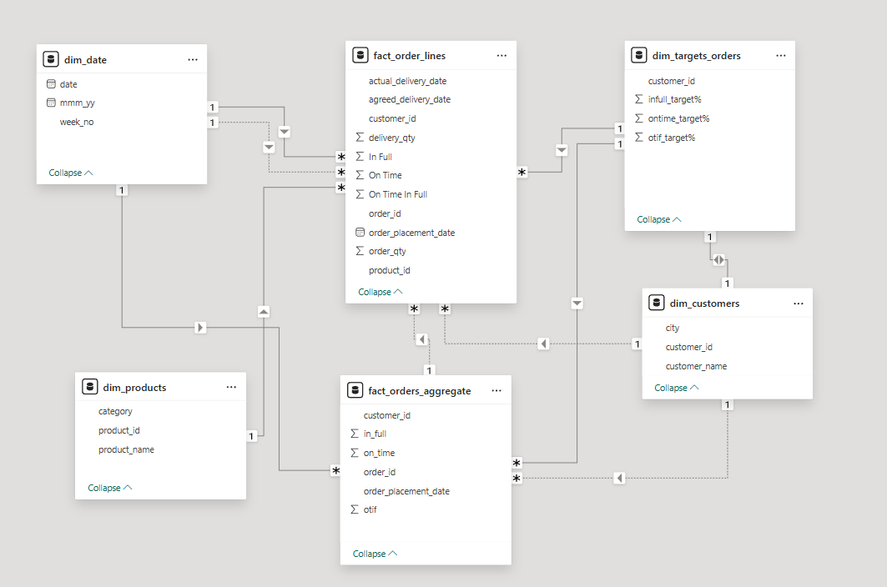
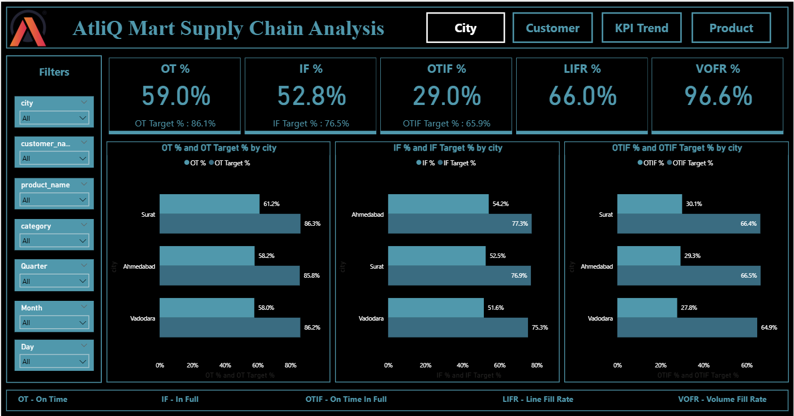
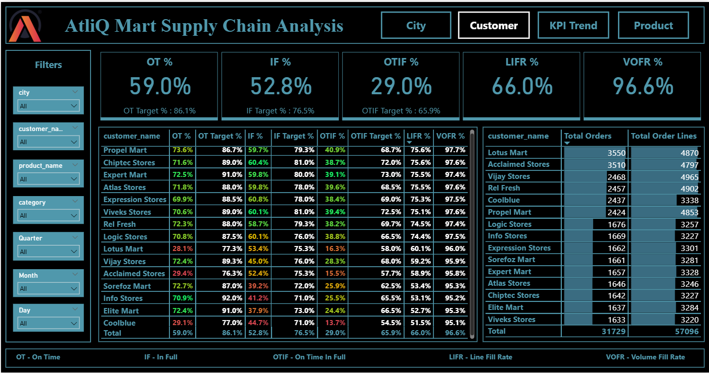
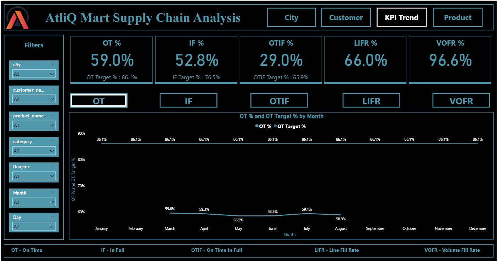
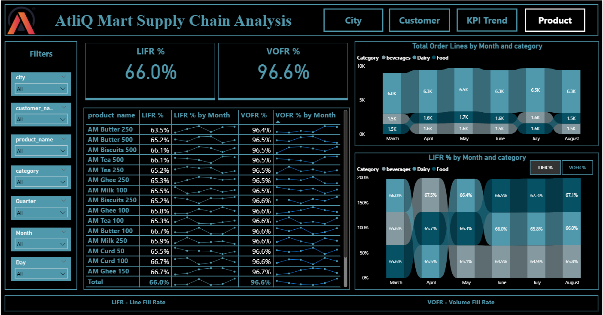

# 🚛 AtliQ Mart Supply Chain Analysis

## 📊 Project Overview

Atliq Mart, a growing FMCG giant, was facing a crisis where several key customers did not renew their annual contracts. The management suspected that poor service levels, specifically regarding delivery timeliness and order completeness, were driving customers to competitors.

This project builds a **Supply Chain Analytics Report in Power BI** to monitor service level KPIs and identify the root causes behind customer churn.

---

# 🎯 Business Objective

The main objectives of this analysis were to:

- Track **On-Time Delivery (OT%)**
- Track **In-Full Delivery (IF%)**
- Monitor **Perfect Order Rate (OTIF%)**
- Compare **actual performance vs SLA targets**
- Identify **which customers, cities, and product categories drive service failures**

---

# 📊 Key KPIs

| KPI | Description |
|----|----|
| OT% | Percentage of orders delivered on time |
| IF% | Percentage of orders delivered in full |
| OTIF% | Perfect orders delivered both on time and in full |
| LIFR | Line Fill Rate – order lines fulfilled completely |
| VOFR | Volume Fill Rate – overall quantity fulfillment |

---

# 📉 Key Insights

### 1️⃣ Service Level Gap

| Metric | Actual | Target |
|------|------|------|
| OT% | 59% | 86% |
| IF% | 52.8% | 76.5% |
| OTIF% | 29% | 65.9% |

Only **3 out of 10 orders** were delivered perfectly.

---

### 2️⃣ The Volume–Line Paradox

- **Volume Fill Rate:** 96.6%
- **Line Fill Rate:** 66%

Although most of the **total volume was shipped**, many **specific items were missing**, causing orders to fail the **In-Full criteria**.

---

### 3️⃣ High-Value Customer Risk

Top customers such as:

- Lotus Mart  
- Acclaimed Stores  

had **OTIF rates around ~16%**, creating a **major revenue churn risk**.

---

### 4️⃣ Systemic Operational Issue

OTIF remained **below 30% across all cities**:

- Surat
- Ahmedabad
- Vadodara

This suggests the root cause is likely **warehouse operations or supply planning**, rather than transportation.

---

### 5️⃣ Dairy Category Impact

The **Dairy category** generated the highest volume (~6.5K order lines per month).

Due to its **perishable nature**, low line fill rates directly lead to:

- Retail shelf stockouts
- Lost sales
- Reduced customer satisfaction

---

# 📈 Strategic Recommendations

## Inventory Optimization
Shift focus from **total volume metrics** to **SKU-level inventory planning** to improve Line Fill Rate.

## Warehouse Efficiency
Implement **Scan-to-Verify systems** to reduce picking errors and ensure correct SKU selection.

## Safety Stock Strategy
Increase safety stock for **high-demand Dairy SKUs** to stabilize supply.

## Delivery Target Alignment
Adjust delivery targets and add **lead-time buffers** to better align operational capacity with customer promises.

---

# 🛠 Tech Stack

**Tool**
- Power BI

**Techniques**
- Data Modeling (Star Schema)
- DAX Measures
- Power Query Data Transformation
- KPI Dashboard Design
- Supply Chain Analytics

---

# 📷 Dashboard Preview

## Data Modelling

## City Analysis

## Customer Analysis

## Trend Analysis

## Product Analysis

---

# 📊 Dataset

Dataset provided by **Codebasics Resume Project Challenge**

Tables used:

- Customers
- Products
- Date
- Targets
- Order Lines
- Aggregated Orders

---

# 📌 Business Impact

This analysis revealed a **36.9% gap in perfect order fulfillment**.

The root cause was **not lack of inventory volume**, but **incorrect SKU availability and fulfillment inefficiencies**.

These insights help drive:
- Better **inventory planning**
- Improved **warehouse operations**
- Stronger **customer retention strategies**

---

